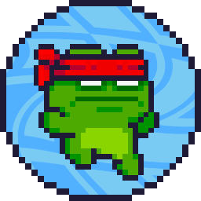
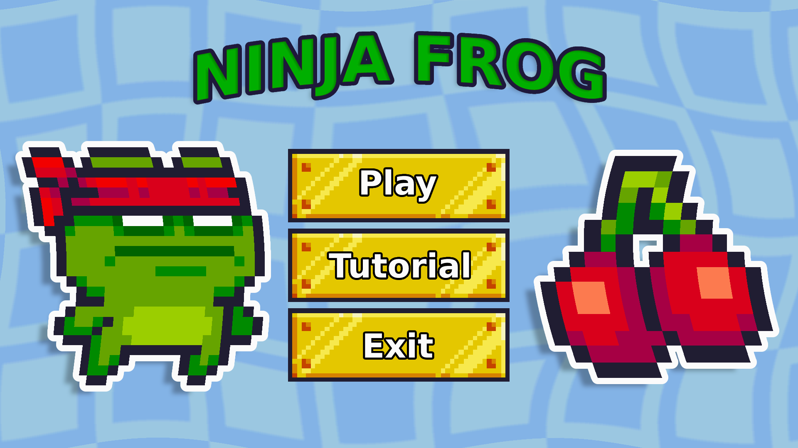
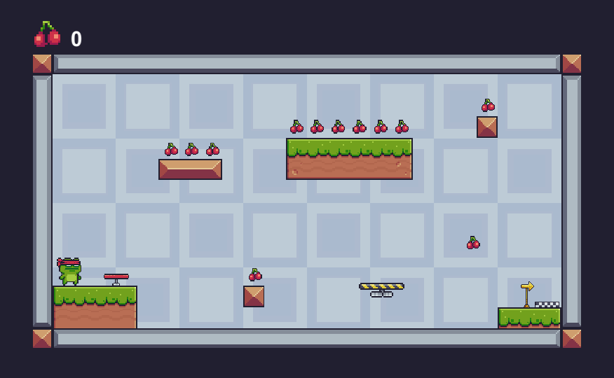

<p align="center">
  </img>
</p>

<p align="center" style="margin: 50px">
  <a href="https://github.com/gcairesdev/ninja-frog">
    </img>
  </a>
  <a href="https://github.com/gcairesdev/ninja-frog/blob/master/LICENSE.md">
    </img>
  </a>
  <a href="https://github.com/gcairesdev/ninja-frog">
    </img>
  </a>
</p>

# Índice

* [Sobre o projeto](#ninja-frog)
  * [Feito com](#feito-com)
  * [Objetivo](#objetivo)
  * [Justificativa](#justificativa)
* [Iniciando](#iniciando)
  * [Pré requisitos](#pré-requisitos)
  * [Instalação](#instalação)
* [Contribuindo](#contribuindo)
* [Autor](#autor)
* [Licença](#licença)

## Ninja Frog
> Jogo de plataforma 2D feito na Unity.

Colete "moedas" (cerejas), pule em plataformas, derrote inimigos (pulando em sua cabeça), passe de fases... Enfim, apenas o básico de um jogo de plataforma.

<p align="center">
  </img>
  </img>
</p>

## Feito com
* [Unity](https://unity.com/pt)
* [C#](https://docs.microsoft.com/pt-br/dotnet/csharp/)

## Objetivo

O projeto tem como objetivo o estudo de criação de jogos usando a plataforma Unity.

## Justificativa

Gosto de jogos, então por que não criar um?

## Iniciando

Para iniciar, veja os pré requisitos do projeto.

## Pré requisitos
* [Unity](https://unity.com/pt)

## Instalação

Clone o repositório:

```git
git clone https://github.com/gcairesdev/ninja-frog
```

Add a pasta no Unity Hub e execute.

## Autor

|                |                  |          |            |         |
|----------------|------------------|----------|------------|---------|
| ![][githubImg] | Guilherme Caires | [Github] | [Linkedin] | [Email] |

## Contribuindo

Confira a página [CONTRIBUTING](./CONTRIBUTING.md) para ver os melhores locais para arquivar problemas, iniciar discussões e começar a contribuir.

## Licença

Lançado em 2021.
Este projeto está sob a [Licença MIT](./LICENSE.md).

---

<p align="center">
  Feito com :heart: por
  <a href="https://github.com/gcairesdev">Guilherme Caires<a>
</p>

<!-- Markdown link & img dfn's -->
[Github]: https://github.com/gcairesdev
[GithubImg]: https://avatars.githubusercontent.com/u/54117888?s=100
[Linkedin]: https://linkedin.com/in/guilherme-caires/
[Email]: contatogcaires@gmail.com